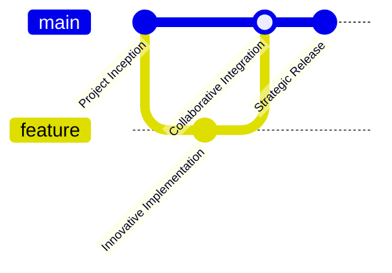

# 🌟Stripe Starter Kit

<div align="center">
  
  
  ## Simple Payment Integration Solution 💳

  <p align="center">
    
    
    
    
  </p>
</div>

## Project Overview

A developer-friendly starter kit for streamlined Stripe payment integration. Designed to simplify and enhance payment processing for web applications.

## Key Features

> 🔒 **Strong Security**
> Robust Stripe integration with comprehensive protection

> 💨 **High Performance**
> Fast and efficient with Bun and Next.js

> 🛡️ **Flexible Architecture**
> Modular and easily expandable framework

> 📊 **Detailed Monitoring**
> Advanced logging and transaction tracking

## Technology Stack 

<p align="center">
  
</p>

| Category | Technologies | Purpose |
|----------|--------------|---------|
| **Core** | TypeScript, Next.js, Bun | Reliable, type-safe foundation |
| **Payments** | Stripe | Secure payment processing |
| **Database** | Prisma, PostgreSQL | Modern database management |
| **Validation** | Zod | Type checking |
| **Logging** | Pino | Performance logging |

## Quick Setup

### System Requirements

- Bun 1.0+
- Node.js 18+
- Stripe Account

```bash
# Clone the repository
git clone https://github.com/duggal1/stripe-kit.git

# Navigate to the project directory
cd stripe-kit

# Install dependencies
bun install

# Launch the development server
bun dev
```


## Project Commands

| Command | Function |
|---------|----------|
| `bun dev` | Start local development |
| `bun test` | Run tests |
| `bun lint` | Check code quality |
| `bun build` | Prepare for production |

## Contributing

### Ways to Contribute

1. Report issues
2. Suggest improvements
3. Submit pull requests

### Contribution Workflow



## Contributors

<p align="center">
  <a href="https://github.com/duggal1/stripe-kit/graphs/contributors">
    
  </a>
</p>

## Project Status

<p align="center">
  
  
</p>

## Licensing

MIT License - Free for personal and commercial use.

## Support the Project

- Spread the word
- Provide feedback
- Consider sponsoring

---

<div align="center">
  <sub>Building Payment Solutions, One Commit at a Time 🌟</sub>
  
  **Created with ❤️ by Harshit Duggal**
</div>
