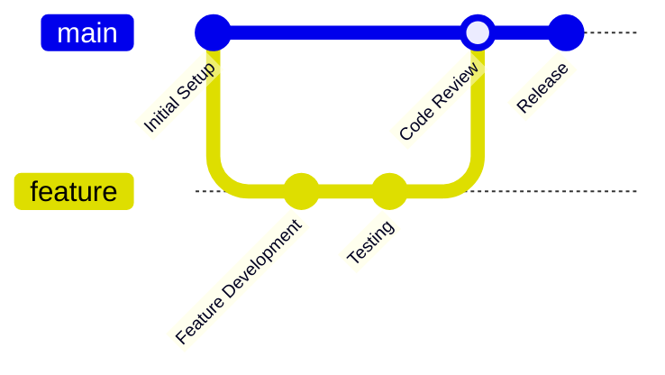

<div align="center">
  
  
  <h1>Stripe Starter Kit</h1>
  <p>Modern Payment Integration Solution for Next.js Applications</p>

  <div class="badge-container">
    <a href="https://github.com/duggal1/stripe-kit/stargazers">
      
    </a>
    <a href="https://github.com/duggal1/stripe-kit/network/members">
      
    </a>
    <a href="https://github.com/duggal1/stripe-kit/issues">
      
    </a>
    <a href="https://github.com/duggal1/stripe-kit/blob/main/LICENSE">
      
    </a>
  </div>
</div>

## Overview

A developer-friendly starter kit for streamlined Stripe payment integration. Designed to simplify and enhance payment processing for web applications.

## ✨ Key Features

<div class="feature-grid">
  <div class="feature-item">
    <h3>🔒 Strong Security</h3>
    <p>Robust Stripe integration with comprehensive protection</p>
  </div>
  <div class="feature-item">
    <h3>💨 High Performance</h3>
    <p>Fast and efficient with Bun and Next.js</p>
  </div>
  <div class="feature-item">
    <h3>🛡️ Flexible Architecture</h3>
    <p>Modular and easily expandable framework</p>
  </div>
  <div class="feature-item">
    <h3>📊 Detailed Monitoring</h3>
    <p>Advanced logging and transaction tracking</p>
  </div>
</div>

## 🛠️ Technology Stack

<div align="center">
  
</div>

| Category | Technologies | Purpose |
|:---------|:------------|:---------|
| **Core** | TypeScript, Next.js, Bun | Reliable, type-safe foundation |
| **Payments** | Stripe | Secure payment processing |
| **Database** | Prisma, PostgreSQL | Modern database management |
| **Validation** | Zod | Type checking |
| **Logging** | Pino | Performance logging |

## 🚀 Quick Setup

### Prerequisites

- Bun 1.0+
- Node.js 20+
- Stripe Account

```bash
# Clone the repository
git clone https://github.com/duggal1/stripe-kit.git

# Navigate to the project directory
cd stripe-kit

# Install dependencies
bun install

# Launch the development server
bun dev
```

## 📦 Components

- `<StripeProvider />` - Stripe context provider
- `<PaymentForm />` - Customizable payment form
- `<PricingTable />` - Responsive pricing tables
- `<SubscriptionManager />` - Subscription handling
- `<PaymentHistory />` - Transaction history display
- `<InvoiceViewer />` - Invoice management
- `<PaymentStatus />` - Real-time payment status
- `<CustomerPortal />` - Customer management interface

## 🤝 Contributing

We welcome contributions! Here's how you can help:

### Getting Started

1. Fork the repository
2. Create your feature branch (`git checkout -b feature/AmazingFeature`)
3. Commit your changes (`git commit -m 'Add some AmazingFeature'`)
4. Push to the branch (`git push origin feature/AmazingFeature`)
5. Open a Pull Request

### Development Workflow



## 👥 Contributors

<div align="center">
  <a href="https://github.com/duggal1/stripe-kit/graphs/contributors">
    
  </a>
</div>

## 📊 Project Status

<div align="center">
  
  
  
</div>

## 📄 License

### Personal Use
- Free for personal and educational use
- Must credit the author
- Cannot change core payment logic

### License Features
| Feature | Personal | Commercial |
|:--------|:---------|:-----------|
| Core Features | ✓ | ✓ |
| Updates | Security only | Full updates |
| Commercial Use | ✗ | ✓ |

## 💝 Support

If you like this project, consider supporting it:

<div align="center">
  <a href="https://github.com/sponsors/duggal1">
    
  </a>
  
  <a href="https://stripe-kit.dev/sponsor">
    
  </a>
</div>

### Why Sponsor?
- 🚀 Support ongoing development
- ⭐ Get priority support
- 🎯 Influence feature roadmap
- 💎 Access exclusive components
- 🛡️ Commercial license included

<div align="center">
  <sub>Your support keeps this project alive! 💖</sub>
</div>

---

<div align="center">
  <p>Building Payment Solutions, One Commit at a Time 🌟</p>
  <sub>Created with ❤️ by Harshit Duggal</sub>
</div>
